# Advanced E-commerce Project (Laravel 9)

A professional and fully functional E-commerce application built with **Laravel 9**. This project includes a comprehensive Admin Panel for inventory management and a dynamic Front-end for users to browse and purchase products.

## 🚀 Key Features

### 💻 Admin Panel Features:
* **Secure Authentication:** Admin registration, login, and profile management with image upload.
* **Catalog Management:** Manage Product Sections, Categories (Parent/Sub), and Brands.
* **Product Management:** * Add/Edit products with multiple images and video links.
    * Dynamic product attributes (Size, SKU, Price, Stock).
    * Product filtering and search functionality.
* **Promotions:** Coupon management system to offer discounts.
* **Logistics:** Manage shipping charges and order status updates.
* **Data Export:** Export data using DataTables (Excel, CSV, PDF, Print).

### 🛒 User Front-end Features:
* **Dynamic Homepage:** Featured products, latest arrivals, and banner sliders.
* **Product Interaction:** Detailed product pages with stock availability and related products.
* **Shopping Cart:** Fully functional cart system with dynamic updates.
* **Checkout System:** Secure checkout with multiple payment methods.
* **Payment Gateways:** Integrated with **PayPal**, **SSLCommerz**, and **Cash on Delivery (COD)**.
* **User Dashboard:** Customer registration, login, and order history tracking.

## 🛠️ Technology Stack
* **Backend:** Laravel 9
* **Database:** MySQL
* **Frontend:** Blade Template Engine, Bootstrap, jQuery
* **Admin Theme:** AdminLTE 3
* **Icons:** Font Awesome

## Project Images
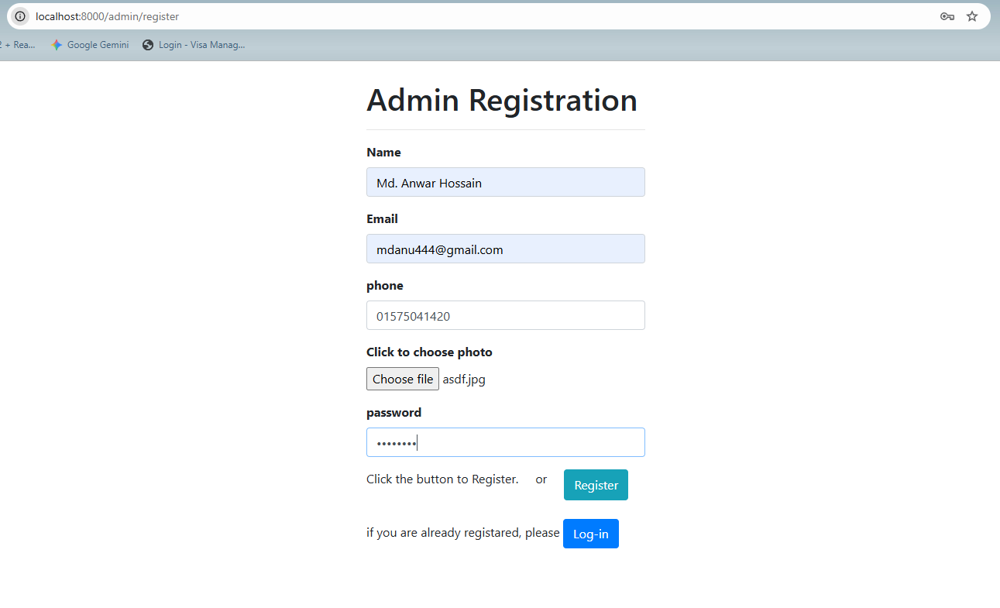


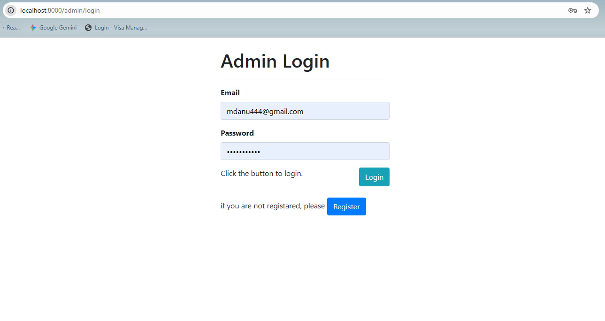

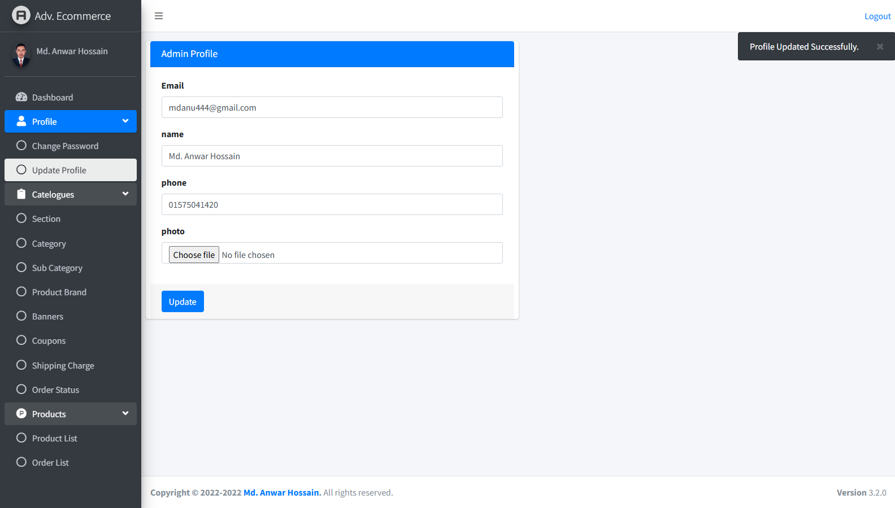

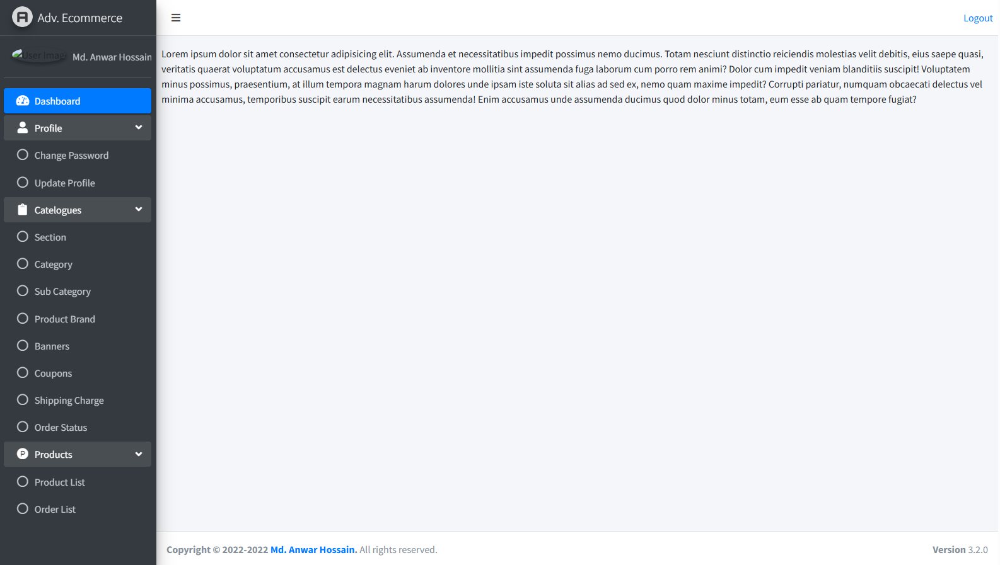

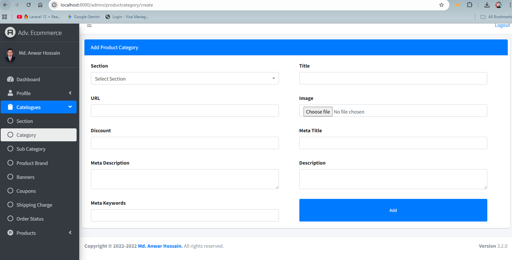

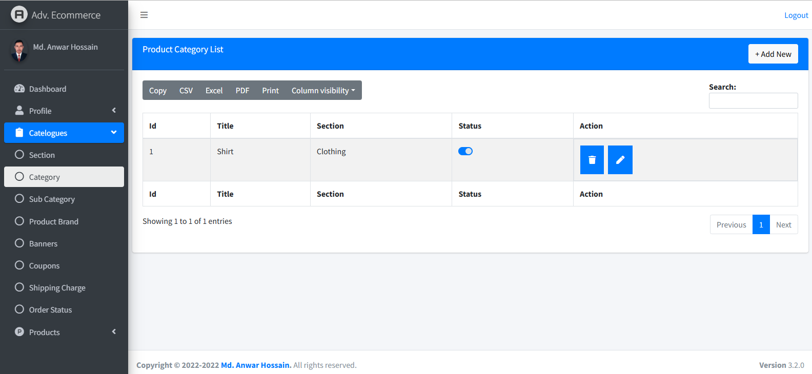

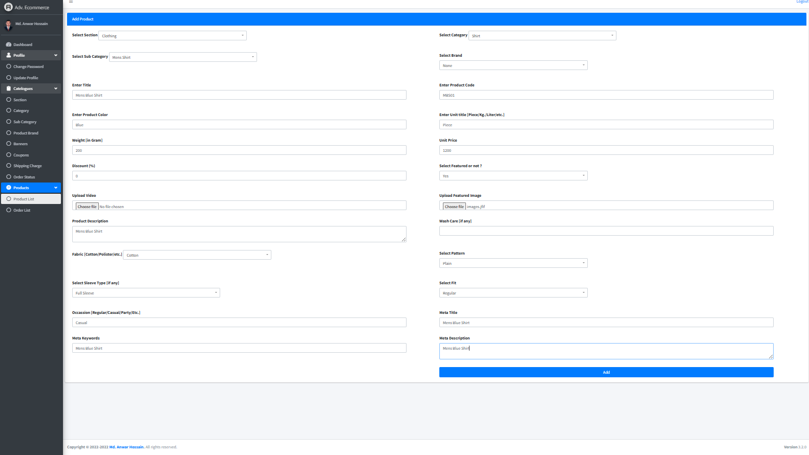

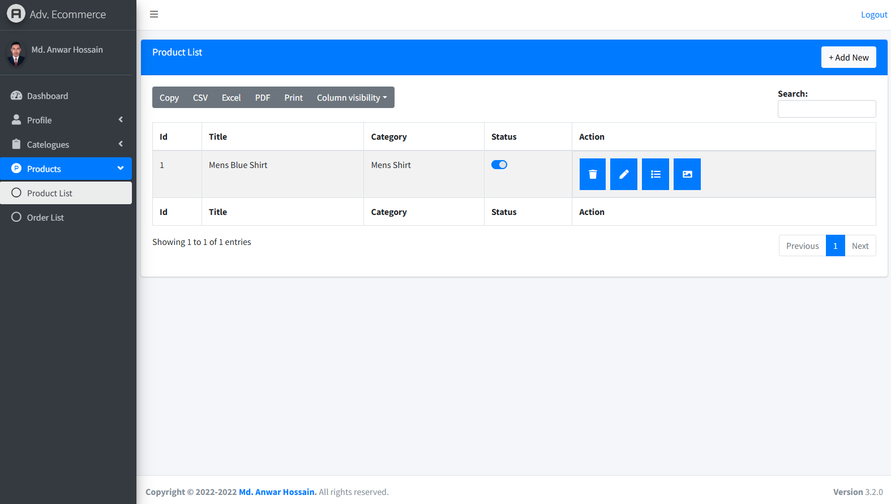

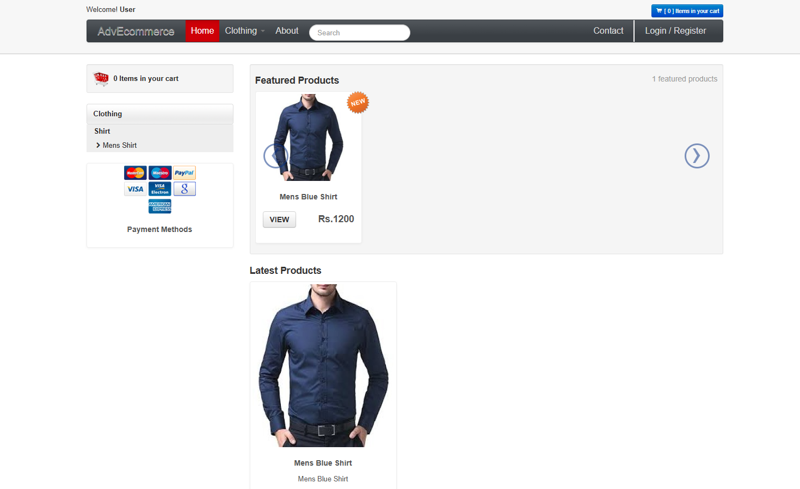

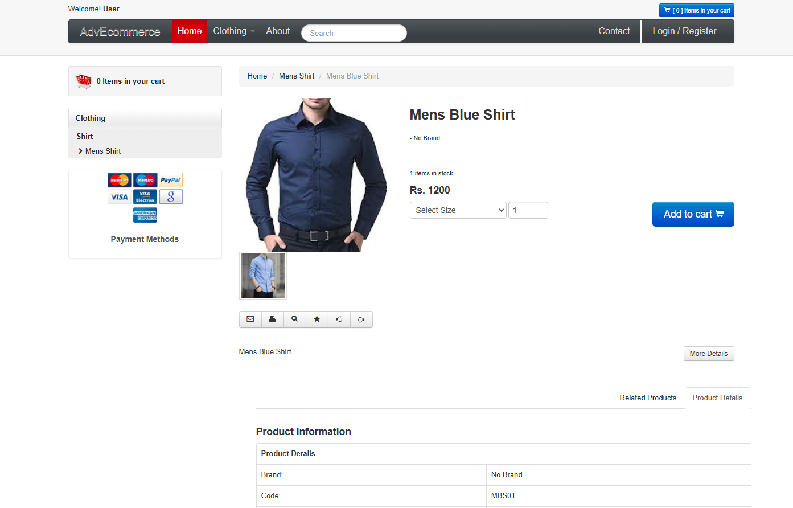

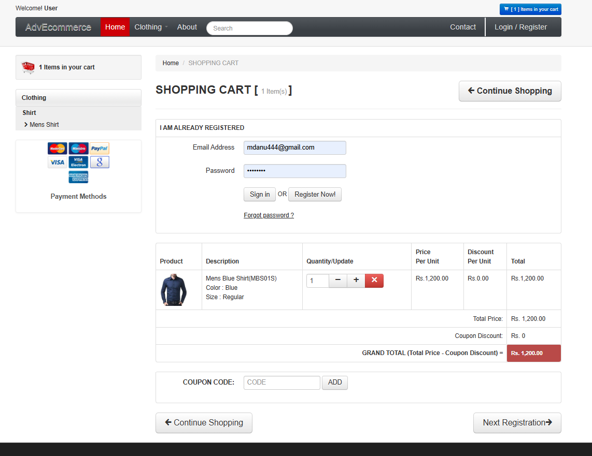

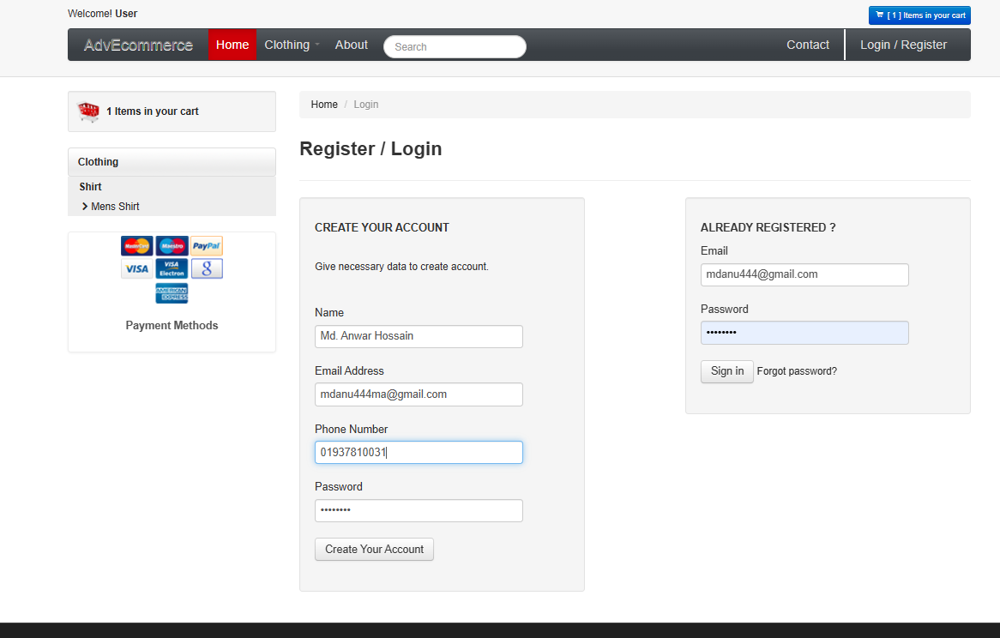

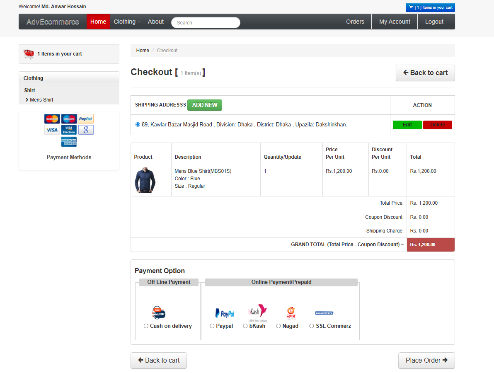

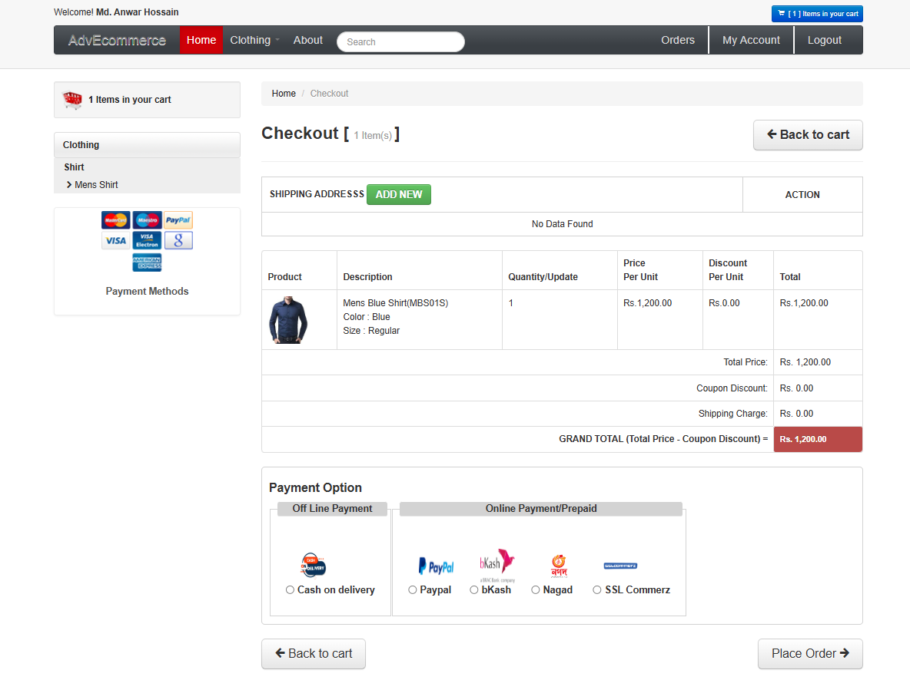

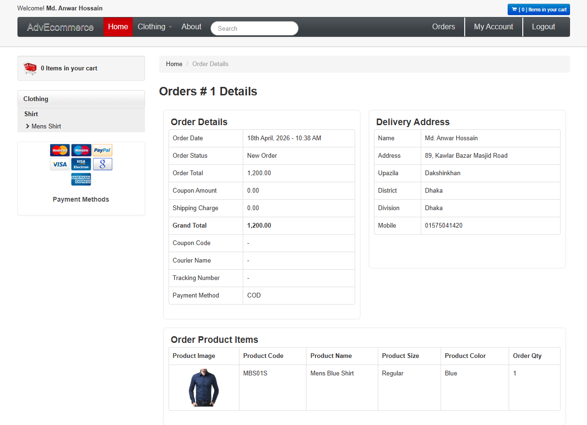

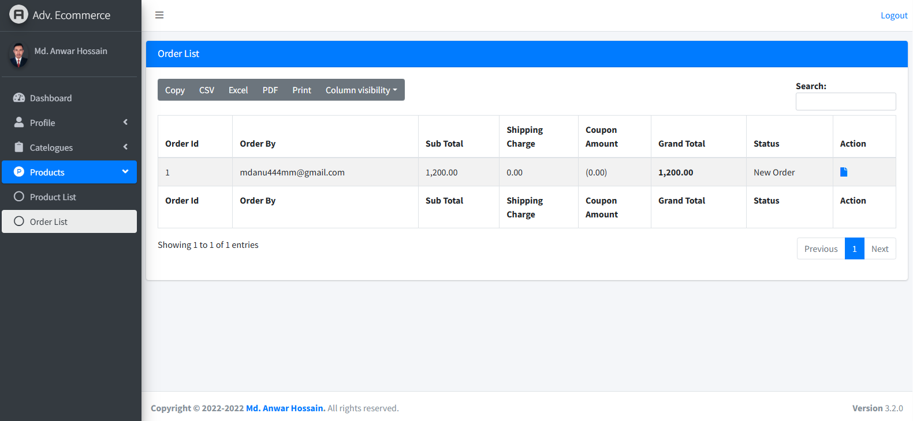

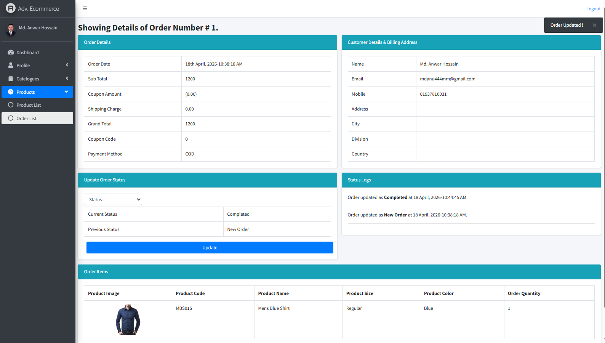


## ⚙️ Installation Guide

1. **Clone the repository:**
   ```bash
   git clone [https://github.com/your-username/your-repo-name.git](https://github.com/your-username/your-repo-name.git)
